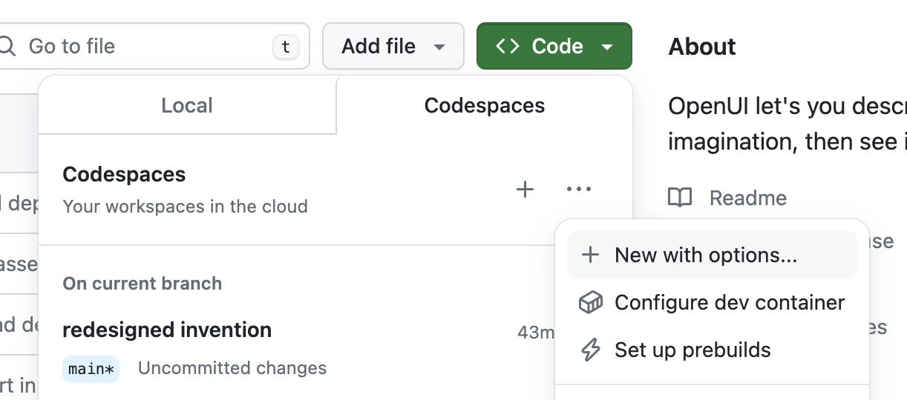

# OpenUI

Building UI components can be a slog.  OpenUI aims to make the process fun, fast, and flexible.  It's also a tool we're using at [W&B](https://wandb.com) to test and prototype our next generation tooling for building powerful applications on top of LLM's.

## Overview


OpenUI let's you describe UI using your imagination, then see it rendered live.  You can ask for changes and convert HTML to React, Svelte, Web Components, etc.  It's like [v0](https://v0.dev) but open source and not as polished :stuck_out_tongue_closed_eyes:.

## Live Demo

[Try the demo](https://openui.fly.dev)

## Running Locally

You can also run OpenUI locally and use models available to [Ollama](https://olama.com).  [Install Ollama](https://ollama.com/download) and pull a model like [CodeLlama](https://ollama.com/library/codellama), then assuming you have git and python installed:

```bash
git clone https://github.com/wandb/openui
cd openui/backend
# You probably want to do this from a virtual environment
pip install .
# This must be set to use OpenAI models, find your api key here: https://platform.openai.com/api-keys
export OPENAI_API_KEY=xxx
python -m openui
```

### Docker

You can build and run the docker file from the `/backend` directory:

```bash
docker build . -t wandb/openui --load
docker run -p 7878:7878 -e OPENAI_API_KEY wandb/openui
```

Now you can goto [http://localhost:7878](http://localhost:7878)

## Development

A [dev container](https://github.com/wandb/openui/blob/main/.devcontainer/devcontainer.json) is configured in this repository which is the quickest way to get started.

### Codespace



Choose more options when creating a Codespace, then select **New with options...**.  Select the US West region if you want a really fast boot time.  You'll also want to configure your OPENAI_API_KEY secret or just set it to `xxx` if you want to try Ollama *(you'll want at least 16GB of Ram)*.

Once inside the code space you can run the server in one terminal: `python -m openui --dev`.  Then in a new terminal:

```bash
cd /workspace/openui/frontend
npm run dev
```

This should open another service on port 5173, that's the service you'll want to visit.  All changes to both the frontend and backend will automatically be reloaded and reflected in your browser.

### Resources

See the readmes in the [frontend](./frontend/README.md) and [backend](./backend/README.md) directories.
